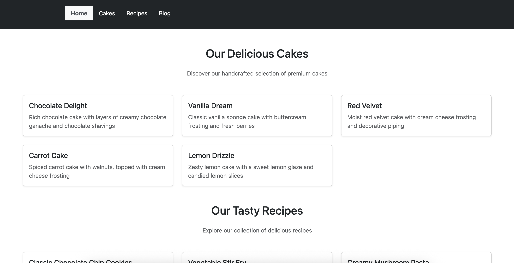
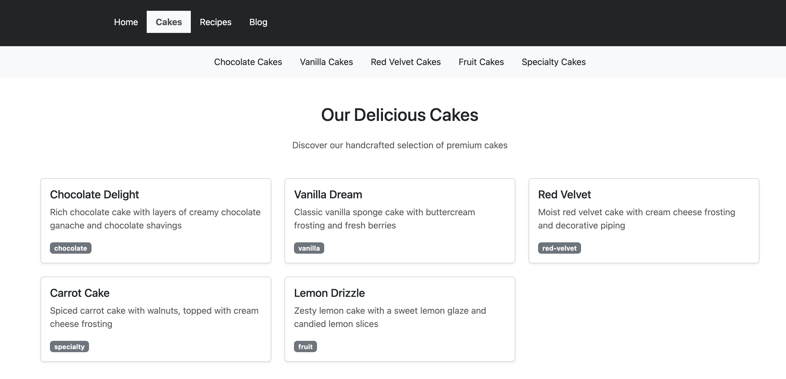
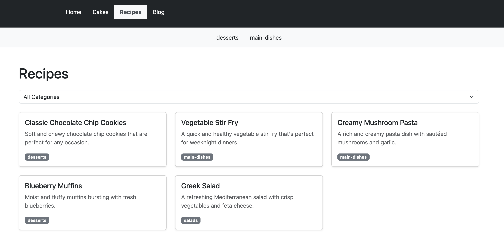
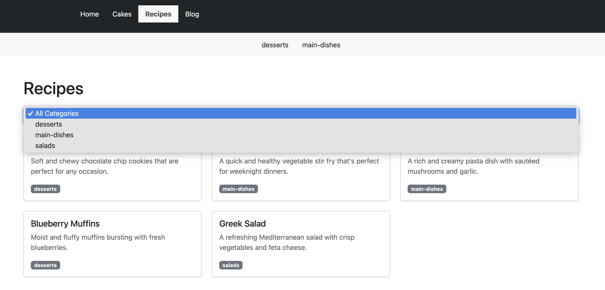
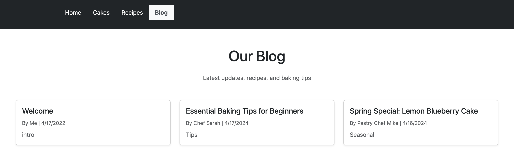
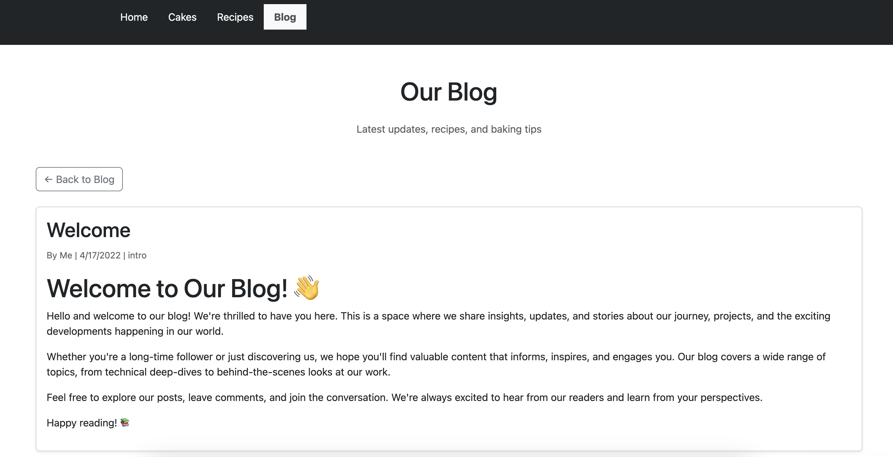

# Dashboard Application

A modern React dashboard application built with TypeScript and Vite, featuring a beautiful UI and responsive design.

## Features

- 🎨 Modern and responsive UI
- ⚡ Fast performance with Vite
- 📱 Mobile-friendly design
- 🔍 Type-safe development with TypeScript
- 🧪 Comprehensive testing setup

## Screenshots

### Home Page


### Cakes Section


### Recipes Section


### Dynamic Recipe Selector


### Blog Section


### Async Posts Loading


## Tech Stack

- React 18
- TypeScript
- Vite
- ESLint for code quality
- Vitest for testing

## Getting Started

1. Clone the repository
2. Install dependencies:
   ```bash
   npm install
   ```
3. Start the development server:
   ```bash
   npm run dev
   ```
4. Build for production:
   ```bash
   npm run build
   ```

## Development

This project uses Vite with the following plugins:
- [@vitejs/plugin-react](https://github.com/vitejs/vite-plugin-react) for Fast Refresh
- [@vitejs/plugin-react-swc](https://github.com/vitejs/vite-plugin-react-swc) for even faster refresh times

## Code Quality

The project includes comprehensive ESLint configuration for type-aware linting. See the ESLint configuration file for details on the rules and plugins used.
